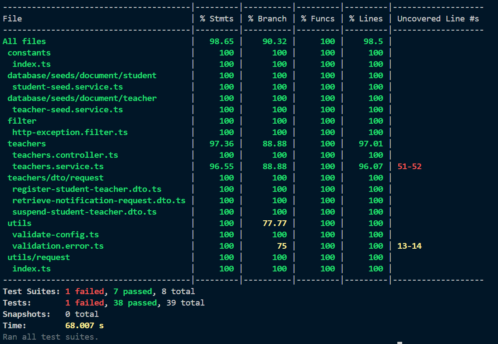

## Table of Contents

- [Technologies used](#technologies-used)
- [Project Structure](#project-structure)
- [Prerequisites](#prerequisites)
- [Installation](#installation)
  - [Run the App](#run-the-app)
  - [Run Unit Tests](#run-unit-tests)
- [About the Project](#about-the-project)
  - [Models](#models)
  - [Endpoints](#endpoints)

## Technologies Used

- **Backend**: NodeJS, NestJS
- **Testing tool**: Jest
- **Database**: MySQL, TypeORM
- **Containerization**: Docker engine and Docker Compose

## Project Structure


```
src
├─ app.module.ts
├─ config
│  ├─ app-config.type.ts
│  ├─ app.config.ts
│  └─ config.type.ts
├─ constants
│  └─ index.ts
├─ database
│  ├─ config
│  │  ├─ database-config.type.ts
│  │  └─ database.config.ts
│  ├─ data-source.ts
│  ├─ migrations
│  │  └─ index.ts
│  ├─ seeds
│  │  └─ document
│  │     ├─ run-seed.ts
│  │     ├─ seed.module.ts
│  │     ├─ student
│  │     │  ├─ student-seed.module.ts
│  │     │  ├─ student-seed.service.ts
│  │     │  └─ test
│  │     │     └─ student-seed.service.spec.ts
│  │     └─ teacher
│  │        ├─ teacher-seed.module.ts
│  │        ├─ teacher-seed.service.ts
│  │        └─ test
│  │           └─ teacher-seed.service.spec.ts
│  └─ typeorm-config.service.ts
├─ filter
│  ├─ http-exception.filter.ts
│  └─ test
│     └─ http-exception.filter.spec.ts
├─ main.ts
├─ student
│  └─ entities
│     └─ student.entity.ts
├─ teachers
│  ├─ dto
│  │  ├─ request
│  │  │  ├─ register-student-teacher.dto.ts
│  │  │  ├─ retrieve-notification-request.dto.ts
│  │  │  └─ suspend-student-teacher.dto.ts
│  │  └─ response
│  │     ├─ get-common-student-teacher.dto.ts
│  │     └─ retrieve-notification-response.dto.ts
│  ├─ entities
│  │  └─ teacher.entity.ts
│  ├─ teachers.controller.ts
│  ├─ teachers.module.ts
│  ├─ teachers.service.ts
│  └─ test
│     ├─ teachers.controller.spec.ts
│     └─ teachers.service.spec.ts
└─ utils
   ├─ request
   │  ├─ index.ts
   │  └─ test
   │     └─ index.spec.ts
   ├─ test
   │  ├─ validation.error.spec.ts
   │  └─ vallidate-config.spec.ts
   ├─ validate-config.ts
   └─ validation.error.ts

```

## Prerequisites

Ensure that you have the following installed:

- [Docker](https://www.docker.com/get-started/) and [Docker Compose](https://docs.docker.com/compose/install/)
- Clone the repository and navigate to the project directory:

  ```bash
  git clone https://github.com/hoangnmdev/education-api-backend.git
  cd education-api
  ```

## Installation

### Run the App

#### 1. Build and start the containers

Run the follow command to start the containers:

```bash
docker-compose up --build
```

This will setup:

- A MySQL server in a container with a mounted volume for persistent storage

#### 2. Generate migration
```bash
npm run migration:generate  src/database/migrations/<Migration_Name>
```

#### 3. Run migration
```bash
npm run migration:run
```

#### 4. Run seed
```bash
npm run seed 
```

#### 5. Run application
```bash
npm run start:dev
```

The application is available at:

```
http://localhost:3000
```

#### 6. Delete the containers

Delete the containers and clean out the volume by running

```
docker-compose down -v
```

### Run Unit Tests

Similarly, open another interactive shell session inside the api server container and execute the test runner



```bash
npm run test
```

## About the Project

The project is built around 2 data models `Student` and `Teacher` represented by their corresponding entities. TypeORM was chosen to interact with the MySQL database. All main functionalities involve around managing the relationship between the two models, including handling registration, get common students, get notification list, and suspend a student.

#### The Teacher Model

Represents the teachers in the system, manages multiple student entities.

- email: the primary key that uniquely identifies a teacher
- students: a relation field representing a list of student entities that the teacher manages

#### The Student Model

Represents the students in the system, can be registered to multiple teacher entities.

- email: the primary key that uniquely identifies a student
- suspended: a boolean value indicating if a student is suspended or not
- teachers: a relation field representing a list of teacher entities the student is registered to

#### The TeacherStudent Model

Facilitate the many-to-many relationship between the Teacher and Student entities by storing the association between their email addresses

- teacherEmail: a foreign key referencing a row in the Teacher table
- studentEmail: a foreign key referencing a row in the Student table

Both foreign keys creates a composite primary key that uniquely identifies a relationship in the table. TypeORM automatically manages and maintains the table and the relationship between the Student and Teacher tables.

### Endpoints

#### Register Students

- **Endpoint:** `POST /api/register`
- **Headers:** `Content-Type: application/json`
- **Success Status:** 204
- **Request Body:**
  - `teacher`: Email of the teacher.
  - `students`: List of student emails.

#### Retrieve Common Students

- **Endpoint:** `GET /api/commonstudents`
- **Success Status:** 200
- **Query Parameters:**
  - `teacher`: One or more teacher emails.
- **Success Response Example:**
  ```json
  {
    "students": ["commonstudent1@gmail.com", "commonstudent2@gmail.com"]
  }
  ```

#### Suspend a Student

- **Endpoint:** `POST /api/suspend`
- **Headers:** `Content-Type: application/json`
- **Success Status:** 204
- **Request Body:**
  - `student`: Email of the student.

#### Retrieve for Notifications

- **Endpoint:** `POST /api/retrievefornotifications`
- **Headers:** `Content-Type: application/json`
- **Success Status:** 200
- **Request Body:**
  - `teacher`: Email of the teacher.
  - `notification`: Text of the notification.
- **Success Response Example:**
  ```json
  {
    "recipients": ["student1@gmail.com", "student2@gmail.com"]
  }
  ```

#### Error Responses

- **Error Response Example:**

```json
{
  "errorType": "BadRequestException",
  "statusCode": 400,
  "message": [
    "each value in teacher must be an email",
    "teacher must contain at least 1 elements",
    "teacher must be an array"
  ]
}
```
